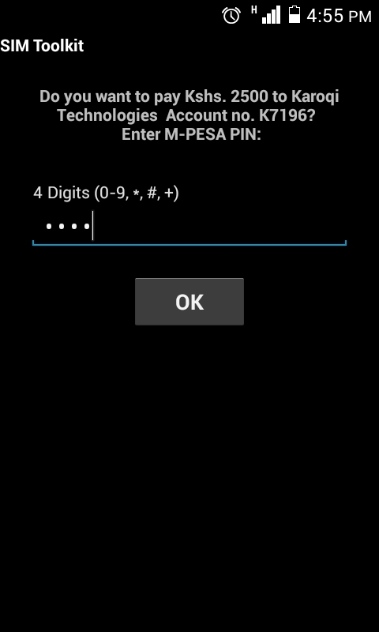

# Tujenge API Version 1

This documentation describes an API exposed by the Tujenge platform intended to be used by other developers building their own applications.

This documentation aims to assist any developer integrate payments to their third party application by leveraging the efficient and powerful ready to use payment
architecture provided by the Tujenge platform.
 
Tujenge provides 3 paybill modes for receiving payments via mpesa

1. The **ready to use** Tujenge Mpesa paybill
2. **Custom** organization Mpesa paybills if they exist
3. Request Tujenge to **acquire a custom** Mpesa paybill   

<aside class="notice">
Whenever an organization is created on the Tujenge platform, the user will be required to
select one of the above as the paybill option to be used for Mpesa. Tujenge recommends individuals
and organizations that don't have an existing Mpesa paybill to select the ready to use Tujenge paybill, and link a
bank account with their organization where funds will be transferred from the paybill.
</aside>

# How Tujenge enables API payments

  * Your third party application triggers a payment through a Tujenge payment API.
  
  * The user making the payment then sees a pop up on their phone that they should use to enter their 
  mpesa pin to complete the payment. 
  
        
  
  * Tujenge process the payment through mpesa.
  
  * Mpesa then sends a confirmation message to the phone number of the user when the payment is complete.
  
  * Tujenge notifies the third party application when the payment is complete

# Tujenge Payments API's

Tujenge currently has the following 2 payments APIs

**Quick Pay API**

This API allows quick payments through Tujenge for any payment use case for any application.

<aside class="notice">
    This API allows third party applications to trigger payments directly through Tujenge quickly and receive a payment notification back
    to the application. Use this api for online checkout and any other payment use case.
</aside>

To interact with the Quick Pay api, [read here](#quick-pay-api)

**Resourced payments API**

This API allows one to create Tujenge payable resources that represent resources in 
third party applications and then Tujenge can enable, process, record, crunch payments data
and notify the third party applications whenever payments are processed for their linked resources.

<aside class="notice">
    Use this API for applications that store items that can be paid for,
    e.g. school fees paid for students, rent paid by tenants e.t.c
    Link your applications items with Tujenge payable resources first via API and tujenge will return a response with payment mechanisms for every item in your application.  Find more information on how to interact with the Resourced Payments API in a later section
    on this document.
</aside>

# Tujenge Payable Resources

These are entities that can be paid for using the Resourced Payments API.

Tujenge payable resources are uniquely identified using `resourceIdentifiers` that must
be provided during payments made using the Resourced Payments API.

Tujenge has 3 types of resources:

1. **Organizations**: A Tujenge organization that can be paid to, it can host other payable resources called collections
 that can also be paid to.
2. **Collections**: A Tujenge collection that can be paid to, it represents, items, activities and processes in an organization.
3. **Personalized Collection Payments**: These are individual payments that are made for a Tujenge collection, they can be made as single payments
 but payments are also recorded as part of a Tujenge collection.
 
To interact and create Tujenge payable Resources, [use the Tujenge Payable Resources API](#payable-resources-api)
 
# Get Started with the API 

Tujenge requires a user to first [create an account](https://tujenge.io/register) on the Tujenge platform in order to start using the Tujenge API. 
If you don't have a Tujenge account, you can [create one here](https://tujenge.io/register) 

Once you have created your account and confirmed your email, you can proceed to [log in](https://tujenge.io/login) to your Tujenge account
where you can see the API link and other features.

# Creating an API Client

[Log in](https://tujenge.io/login) to your Tujenge account and click on the API link, under the API page, click
Create New Client.

Client applications are created by providing an `application name` and a `redirect url`.

Once you have created an application, Tujenge generates a `client id` and a `client secret` that can be used
to authenticate your application uisng OAuth 2.0. schemes that allow Tujenge to generate an `access token`.

# OAuth 2.0 Authentication

Tujenge API uses OAuth 2.0 access tokens to to authenticate third party applications.

## Getting an access token

To get an access token make the HTTP request below:

 > GET https://api.tujenge.io/oauth/token
  
 > Content-Type :  application/json
    
 ```json 
     {
        "grant_type" : "client_credentials",
        "client_id" : "your_client_id",
        "client_secret" : "your_client_secret"
     }
 ```
 > Response
 
 ```json    
     {
         "token_type": "Bearer",
         "expires_in": 31536000,
         "access_token": "access_token"
     } 
 ``` 
   

 Url

`GET https://api.tujenge.io/oauth/token`

 Headers
    
 Key  | Value   
 ---- | ----- 
 Content-Type | application/json
 
 Query parameters

 Parameter |  Type   | Default 
 --------- | ------- | -------
 grant_type| string  | client_credentials         
 client_id | string  |
 client_secret | string|
    
## Using the access token   
    
 With the access token acquired, an application can invoke Tujenge API endpoints by including the
 the access token in the request header as shown below
 
 `Authorization : Bearer your_access_token`
 
# Quick Pay API 

  To initiate a payment, make the following HTTP request
  
   Url
     
  `POST  https://api.tujenge.io/api/v1/quick/payments`
     
   Headers
        
   Key  | Value   
   ---- | ----- 
   Content-Type | application/json
   Authorization | Bearer your_access_token
   
   Query parameters
   
    Parameter |  Type   | Default 
    --------- | ------- | -------
    organizationId| string  |         
    externalIdentifier | string  |
    phoneNumber | string|    |
    amount      | string |   |
    callBackUrl | string |   | 
   
# Resourced Payments API

 > POST https://api.tujenge.io/api/v1/payments
  
 > Content-Type :  application/json
 
 > Authorization : Bearer your_access_token
    
 ```json 
     {
        "organizationId" : "9aa10e10-d831-11e7-9a45-3960414078c9",
        "resourceIdentifier"  : "A6092",
        "phoneNumber"    : "07xxxxxxxx",
        "amount"         : "100",
        "callBackUrl"    : "http://testing.com/api/test"
     }
 ```
 > Response
 
 ```json    
     {
         "message": "Payment is being processed"
     }
 ``` 

Resourced payments are made within the context of a Tujenge organization and for a Tujenge payable resoucre.
Therefore, when making a resourced payment, an `organizationId` and a `resourceIdentifier` have to be inluded in the 
request payload. [Read about Tujenge Payable Resources here](#tujenge-payable-resources) and [read hear](#payable-resources-api) to interact with the [Payable Resoures API](#payable-resources-api).

<aside class="notice">
    Make sure you have an `organizationId` and a `resourceIdentifier` which can be obtained using the 
    `Payable Resource API` or by visiting the resource pages for organizations, collections or personalized collecction payments
     on your Tujenge dashboard.
</aside>

If you have an `organizationId` and a `resourceIdentifier` you can interact with the Payable
Resources API as described below: 

 HTTP Request
 
 Url

`POST https://api.tujenge.io/api/v1/payments`

 Headers
    
 Key  | Value   
 ---- | ----- 
 Content-Type | application/json
 Authorization | Bearer your_access_token
 
 Query parameters
 
 Parameter |  Type   | Default 
  --------- | ------- | -------
  organizationId| string  |         
  resourceIdentifier | string  |
  phoneNumber | string (07xxxxxxx) |
  amount      | integer | 
  callBackUrl | string  |

# Payable Resources API

## Organizations

  > POST https://api.tujenge.io/api/v1/organizations
    
  > Content-Type :  application/json
   
  > Authorization : Bearer your_access_token
      
  ```json 
      {
         "organization_name" : "New Organization"
      }
  ```
  >  Response
   
  ```json    
      {
          "message": "Organization created successfully",
          "organizationId": "ee7aa340-d9ab-11e7-84b3-3d1c8ed84bcc",
          "organizationName": "New Organization",
          "paybillNumber": 936452,
          "accountNumber": "N9288",
          "resourceIdentifier": "N9288",
          "paymentLink": "http://tujenge.io/organization-link/ee7aa340-d9ab-11e7-84b3-3d1c8ed84bcc"
      }
  ``` 
    
   To create an organization use the HTTP request below:
   
   Url
    
  `POST https://api.tujenge.io/api/v1/organizations`   
  
   Headers
      
   Key  | Value   
   ---- | ----- 
   Content-Type | application/json
   Authorization | Bearer your_access_token
   
    Query parameters
    
    Parameter |  Type   | Default 
     --------- | ------- | -------
     organization_name| string  |   

## Collections 

   > POST https://api.tujenge.io/api/v1/collections
      
   > Content-Type :  application/json
     
   > Authorization : Bearer your_access_token
        
   ```json 
    {
       "organizationId" : "ee7aa340-d9ab-11e7-84b3-3d1c8ed84bcc",
       "name"           : "Collection name" 
    }
   ```
   >Response
     
   ```json    
    {
       "message": "Organization created successfully",
       "organizationId": "ee7aa340-d9ab-11e7-84b3-3d1c8ed84bcc",
       "organizationName": "New Organization",
       "paybillNumber": 936452,
       "accountNumber": "N9288",
       "resourceIdentifier": "N9288",
       "paymentLink": "http://tujenge.io/organization-link/ee7aa340-d9ab-11e7-84b3-3d1c8ed84bcc"
    }
   ```   

  To create a collection use the HTTP request below:
  
   Url
    
  `POST https://api.tujenge.io/api/v1/collections`
   
   Headers
   
   Key  | Value   
   ---- | ----- 
   Content-Type | application/json
   Authorization | Bearer your_access_token
    
   Query parameters

    Parameter |  Type   | Default 
    --------- | ------- | -------
    organizationId| string  |     
    name          | string  |   
 
## Personalized collection payments

   > Post https://api.tujenge.io/api/v1/personalized-collection-payments
      
   > Content-Type :  application/json
     
   > Authorization : Bearer your_access_token
        
   ```json 
    {
    	"organizationId" : "9aa10e10-d831-11e7-9a45-3960414078c9",
    	"collectionId" : "57b340d0-d844-11e7-959a-159e3734ee5b",
    	"sms" : "off",
    	"externalIdentifier" : "2345",
    	"phoneNumber"        : "07xxxxxxxx",
    	"name"               : "John",
    	"email"              : "john@doe.com"
    }
   ```
   >  Response 
   
   ```json    
    {
        "message": "success",
        "collectionId": "57b340d0-d844-11e7-959a-159e3734ee5b",
        "organizationId": "9aa10e10-d831-11e7-9a45-3960414078c9",
        "collectionPaymentId": "febea4f0-d9b0-11e7-99c3-9f6d6055c88b",
        "externalIdentifier": "2345",
        "collectionName": "A new collection",
        "paidBy": "John",
        "phoneNumber": "07xxxxxxxx",
        "email": "john@doe.com",
        "paybillNumber": 936452,
        "accountNumber": "A9472",
        "resourceIdentifier": "A9472",
        "paymentLink": "http://tujenge.io/personal-link/febea4f0-d9b0-11e7-99c3-9f6d6055c88b"
    }
   ```   
 To create a personalized collection payment, use the request below:
 
  Url
  
  `Post https://api.tujenge.io/api/v1/personalized-collection-payments`
 
   Headers
    
    Key  | Value   
    ---- | ----- 
    Content-Type | application/json
    Authorization | Bearer your_access_token
    
  Query parameters
  
    Parameter |  Type   | Default 
    --------- | ------- | -------
    organizationId| string  |     
    collectionId  | string  |   
    sms           | string  | off
    externalIdentifier |string |
    phoneNumber        |string |
    name               |string |
    email              |string | 

# Testing on localhost
 
 Tujenge APIs are asynchronous, responses to requests are sent back to the client that
 initiated the request.
  
 To receive responses on your callback urls, the clients should have HTTP post listeners.
 This is achieved by deploying an HTTP listener on a publicly accessible server.
   
 To test on localhost http tunneling clients like [Ngrok](https://ngrok.com/) and [LocalTunnel](https://localtunnel.github.io/www/) can be used to get a public IP
 and make your localhost accessible over the internet.